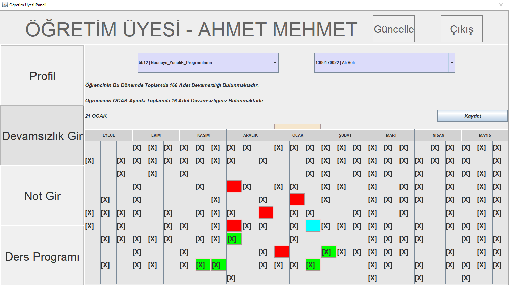

### Project Information
--- 
* Project Name:  
University Automation
 

* Project Team:  
Fadıl Şahin
 

* Project Date:  
April 2020
 

* Project State And Duration:  
Done, 10 days
 

* Project Description:  
Works like university automation system. As a default user which is id=1 password=1 is a student. id=2 password=1 one is lecturer and id=3 password=1 one is administrative officer. Officer can add users for all type of users. For each type there is a ui. At student ui, there is profile, student absenteeism, grades, syllabus pages. Other pages also has profile page an that only shows user informations. In absenteeism page, there is a kind of calendar looking table that shows days of absence and combobox to select lecture. For each lecture table cells change. After selected a lecture, table is loaded and when cells are clicked, the day and month information is shown. In grades page, grades is shown which is registered by lecturer. Syllabus is same as it is known but on click lecture information is shown. If I talk about lecturer ui, it is same as student ui but lecturer can make changes on students' days of absence and grades. In abbsenteeism page, changes can be made with right click and save button. Lastly in the officer ui, students, lecturers, lectures which is taken by students,given by lecturers and syllabus can be added, deleted, and updated. It can be done as a form or making search through lectures and selecting. Files are used as a database.
**Note: To be logged in 'veritabani' must be otomasyon.jar executable file's folder. After that you can use as an initial case id 1 or 2 or 3 and password 1 for all accounts.**
 
 

:exclamation: --------------------------------------------------------------------------------- :exclamation:

- ***Executable jar file is in [root](Otomasyon.jar) folder***

:exclamation: --------------------------------------------------------------------------------- :exclamation:

### Screenshots
---

### Login 

### Profile 

### Lecture Searching

### Adding User To The System 

### Absenteeism Page Of Lecturer 

